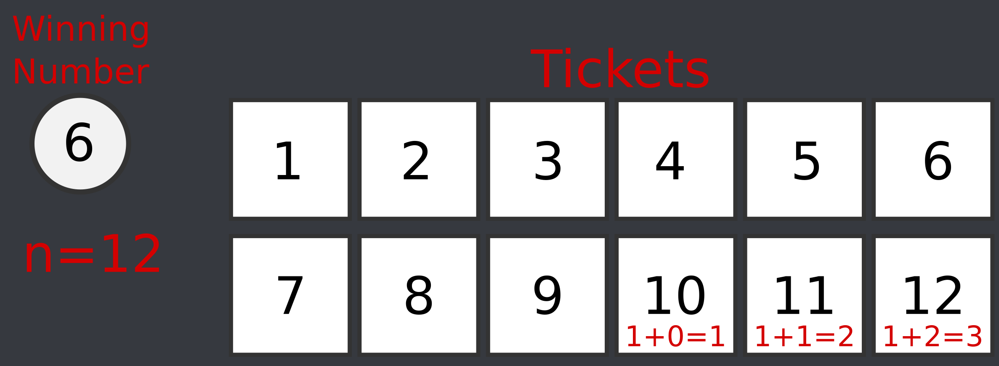

# Lottery Coupons
* The idea is you're given n integer `n` which denotes 2 things
    1. the number of lottery coupons, (_all numbered consecutively from 1 to `n`_)
    2. the number of people taking part in the lottery; each person will receive exactly 1 coupon
* Someone wins when their coupon's digits have a sum equal to `s`.
* If there's multiple winners, the prize is split equally among them.
* The end goal is to determine how many values of `s` there are where at least one person wins and the prize is split amongst the most people.

### Example
* The value of `n` is `12`
* The list of coupon numbers generated from 1 to `n` is `[1, 2, 3, 4, 5, 6, 7, 8, 9, 10, 11, 12]`.
* The sums of the digits are `[1, 2, 3, 4, 5, 6, 7, 8, 9, 1, 2, 3]`.
* The largest number of winners is `2` which will occur for coupons numbered `[1, 10]`, `[2, 11]` and `[3, 12]`.
* The maximum number of possible winners occurs for any of these `3` possible values of `s`, so `3` is the answer.

